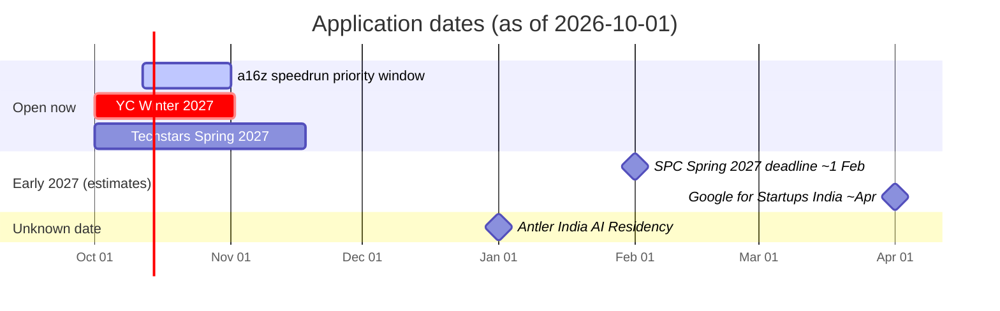

# 02 — How to apply, program by program

All facts read on 2026-10-01 from the official page unless marked **(secondary)** or **UNVERIFIED**. Several application forms sit behind a login, so exact question lists are partly unverified — always read the live form before you start.

**Rule that applies to every program:** apply as two people first. You do not need a company to apply to YC (official FAQ). The research advice is to wait on the US "flip" until you are accepted or have a term sheet. Setting up an Indian Pvt Ltd/LLP earlier is optional, but Surge, NVIDIA, Microsoft, Google India and Nasscom need one, and a sole proprietorship cannot take equity. Which route to take is a decision for you, your lawyers and a CA. See `07-other-findings.md` for the India "flip".

---

## 1. Y Combinator — https://www.ycombinator.com/apply
- **Deadline:** Winter 2027 = **2 Nov 2026, 8pm PT**. Decisions by 11 Dec. Batch Jan–Mar 2027, San Francisco. Late applications are still read but later. "Early Decision" lets you apply now for a later batch.
- **Steps:** create a YC account → fill the online form (about 20–30 questions) → **1-minute founder video** → optional demo → submit. Interview only if shortlisted.
- **Video:** 1 minute, all founders speak, no script, no demo. (YC video page.) "No polish needed" comes from a secondary guide.
- **Known questions:** company in 50 characters; what you make; how far along (users/revenue); something impressive each founder built or achieved; how you will make money; competitors; why you; equity split and legal entity; how you met; who codes; full-time? (Exact form is behind login — UNVERIFIED.)
- **Interview:** 10 minutes on Zoom with 2–3 partners, all founders attend, no slides, decision usually same day.
- **Writing advice from YC:** plain words, answer in the first sentence, show specific impressive things, admit flaws, say how you beat the big players.
- **Cost:** none. **Odds:** about 1% (secondary). About half of funded companies applied more than once.
- **For you:** YC already funds Spott (AI ATS for staffing firms), Alex, Perfectly, Juicebox. Answer "why you, not them, and not Bullhorn" in one clear paragraph.

## 2. a16z speedrun — https://speedrun.a16z.com/apply
- **Deadline:** applications open all year. **Priority (fastest review) window 12 Oct – 1 Nov 2026** for batch SR008 (starts early 2027). Review takes 4–6 weeks.
- **Steps:** enter email → fill the form (exact questions UNVERIFIED) → short video pitch or **15-minute interview** → they may ask for references and data.
- **Needs:** full-time commitment; in person in San Francisco (~12 weeks). Pre-incorporation is fine — they help with incorporation. Visa help through the Global Founders Program; you can apply before you have a visa.
- **Odds:** under 0.4% (official FAQ). Cheap to try.

## 3. Antler India — AI Residency — https://www.antler.co/india
- **Deadline:** next residency "to be announced soon". Antler says "keep reaching out to us directly".
- **Steps:** apply on antler.co/apply (name, email, stage "Idea to Pre-Seed", city, optional pitch deck up to 10MB) → interviews → **3-week residency in Bangalore** → funding decision in 3 weeks. India-specific questions are behind sign-up (UNVERIFIED).
- **Tip from Antler:** "Getting a mutual friend to refer you to us works even better."
- **For you:** wording matches you — "pre-launch, pre-product, or pre-revenue", full-time in Bangalore. Check the other Antler India path, **Embark** (Indian AI founders moving to the US, $450K per team and visa help; Embark 3 closed 28 Mar 2026; next date unknown, secondary source).

## 4. South Park Commons Founder Fellowship — https://www.southparkcommons.com/apply
- **Deadline:** Fall 2026 closed 2 Aug. **Spring 2027 not announced.** Last year's pattern: deadline about 1 Feb, interview invites by end of Feb, bootcamp late March to late May. Expect applications to open about Dec/Jan.
- **Steps:** online form (they want to see "how you generate ideas": approach, markets, ideas considered) → reply in 1–3 weeks → interview(s). Exact questions UNVERIFIED.
- **Needs:** work from an SPC office (San Francisco, New York or **Bangalore**) during the bootcamp. SPC cannot sponsor visas.
- **For you:** SPC leans to "frontier" builders. Show your technical depth (the engine, the evals, the security review) more than the recruiting angle.

## 5. Alchemist Accelerator — https://www.alchemistaccelerator.com/flagship-program
- **Deadline:** unverified. Site still shows the Jan 2026 class. Email admissions@alchemistaccelerator.com.
- **Steps:** online form → answer within about 3 weeks → **15-minute virtual panel** → offer the next week. Exact fields UNVERIFIED.
- **Needs:** enterprise-focused B2B/AI; international is fine. They want buyer proof (pilots, LOIs, named buyers). One-week kick-off in the SF Bay Area, then hybrid for 6 months.
- **Cost:** tuition is taken out of the investment (~$30K net).

## 6. Entrepreneur First — Bangalore — https://apply.joinef.com
- **Deadline:** **5 Oct 2026** (early round; Feb 2027 start). Two later rounds, dates unverified.
- **Steps:** individual application → intro call → 1–3 interviews (technical + behavioural) (secondary). Exact form fields UNVERIFIED.
- **Important:** EF backs **individuals**. Existing co-founders "may apply but should both submit applications" — you and Bushra each apply.
- **Terms:** ₹3.6 lakh on joining; if funded $125K for 8%; optional extra $125K needs a Delaware company and a move to SF. India companies get preference shares (CCPS).
- **For you:** EF suits people still looking for an idea and co-founder. You already have both. Apply only if you want the SF route and the network.

## 7. Techstars — https://apply.techstars.com
- **Deadline:** London / NYC / Anywhere: **18 Nov 2026**, program 8 Mar – 3 Jun 2027. One application can go to several programs.
- **Steps (secondary):** founder profile → ~18 fields (problem, solution, market, team, traction, next milestones) → pick programs → written review → 30-minute call with the managing director → second round → selection panel.
- **Watch out:** "Anywhere" only takes North American time zones. The Workforce (HR) track ran in 2026 but is not in the current list. NYC is hybrid and takes founders from anywhere. Visa help only after acceptance. Techstars wants full-time exclusivity.
- **Terms:** $20K for 5% + $200K uncapped MFN SAFE. India must reorganise into an approved country before money arrives.

## 8. Nasscom GenAI Foundry — https://nasscom.in/ai/genaifoundry
- **Status:** the 3rd cohort (37 startups, Aug 2025) had an "HR and Talent Intelligence Copilots" track. **No 2026 cohort found.** Official page did not load for my tools.
- **Action:** check the page and Nasscom's LinkedIn monthly. Eligibility and application items UNVERIFIED — assume an incorporated Indian startup with a working GenAI product.

## 9. Google for Startups Accelerator: India — https://startup.google.com/accelerator/india/
- **Status:** 2026 round closed 19 Apr. 2027 dates not announced (expect spring).
- **Needs:** India-based, Seed to Series A, AI-first, **past idea stage with customer validation**. About 2,500 applied for 20 places in 2026 (secondary). Equity-free.
- **For you:** target spring 2027 after your first customers.

## 10. Peak XV Surge — https://surge.peakxv.com/apply
- **Deadline:** rolling; reply in 2–3 weeks. No 2026 cohort news found.
- **Form (official):** company (name, website, **country of registration**, category), founders (name, phone, email, LinkedIn, city, background), narrative (one sentence, problem, difference, why your team, stage, traction), optional deck, demo, Loom video, references.
- **For you:** apply once incorporated and with a demo link and a few customer conversations.

---

## Free perks to take right after you incorporate
- **NVIDIA Inception** — free, rolling. Needs an incorporated company and a working website. Excludes consulting firms, so describe Talenfra as a product.
- **Microsoft for Startups** — free, rolling. $200 credits at once; up to $150K needs an investor referral code.

## Not recommended now
- **500 Fellowship** — deadline 2 Oct 2026 (tomorrow), $35,000 fee. See `01-top-10-programs.md`.
- **SHRM Labs WorkplaceTech** — closes 1 Nov 2026; needs paying customers. Plan for the 2027–28 cycle.

## Application timeline

(Antler India, Alchemist and Nasscom have no confirmed date; the Antler marker is only a placeholder.)
